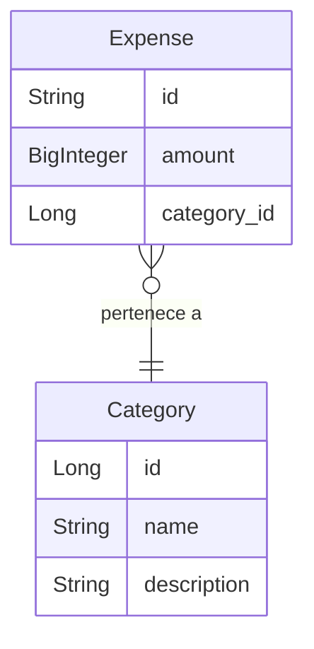

# Ejemplo Jakarta EE - Java Persistence API (JPA)

## Intención

Este ejemplo muestra cómo usar la API de Persistencia de Java (JPA) en una aplicación web de Jakarta EE. Este ejemplo 
presenta los ejemplos más comúnes de JPA en una aplicación así como un par de usos avanzados. El dominio de la 
aplicación es un sistema de seguimiento de gastos.

## Diagrama entidad-relación

Las entidades contenidas en el paquete [io.github.alexpercont.jakartaee.examples.persistence.entities](src/main/java/io/github/alexpercont/jakartaee/examples/persistence/entities) 
representan el siguiente diagrama entidad-relación.

## Lista de ejemplos.

- [Mapeo de una entidad](src/main/java/io/github/alexpercont/jakartaee/examples/persistence/entities/ExpenseCategory.java)
- [Relación 1:N unidireccional](src/main/java/io/github/alexpercont/jakartaee/examples/persistence/entities/Expense.java)
